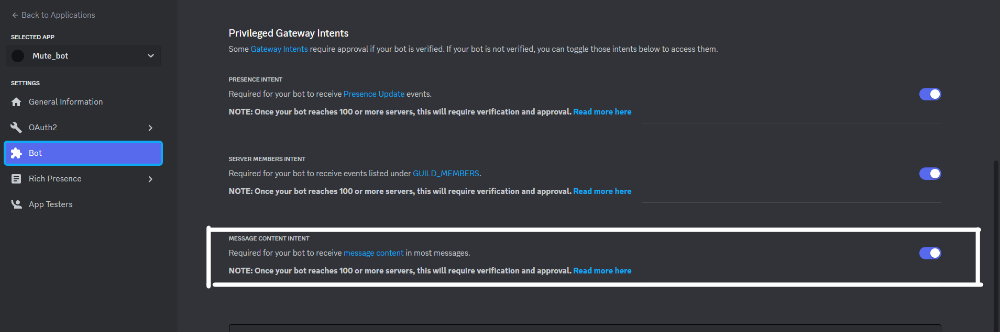

Discord Custom Emote Usage bot, is a simple bot capable of tracking custom emote usage on a daily bases for each guild
the bot is joined into.

Requirements:
- Install [Python](https://www.python.org/downloads/).
- Install requirements with Python's PIP: ``python -m pip install -r requirements.txt``.

Features:

- Custom emote tracking
- Daily usage for last 30 days
- Supports emote replacement for emote with the same name (eg. switching regular emotes to Christmas emotes 🎄)

Configuration:

- Open ``emote_track.py`` and edit (account) ``TOKEN``, ``IS_USER`` (selfbot) and (command) ``PREFIX``.

Usage:

- Enable privileged intents in the Discord developer portal https://discord.com/developers/applications (if on bot account):
  - Message content
    

- Run ``emote_track.py`` with ``python emote_track.py``
- Profit

Command help:

- Usage command: ``<prefix>usage`` (eg. ``@@usage``)
- For help with other commands run ``<prefix>help`` (eg. ``@@help``)
